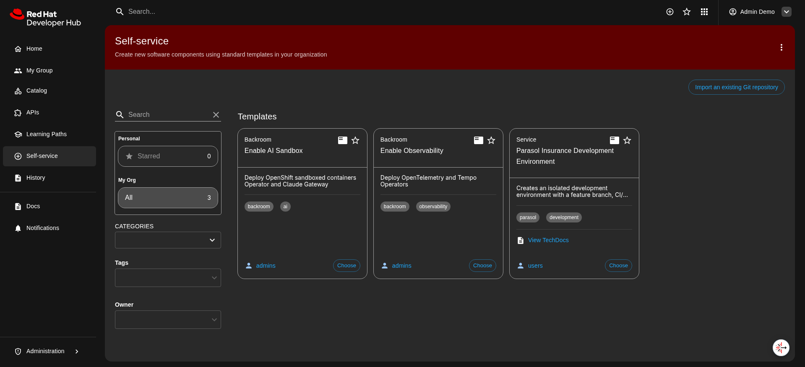

# Red Hat Launch Workshop - Backroom

The Launch Workshop is extensible and intended to layer on a curated developer experience (OpenShift Dev Day Roadshow) with customized module content.  The customized module content may require additional Day 2 OpenShift operators and other platform customization to be applied.

## Backroom Concept

Taking the storefront concept, [showroom](https://github.com/rhpds/ocp-dev-days-rdshw-showroom) is a lab guide for the base workshop offering.  Backroom is additional Day 2 platform customizations that can be applied to introduce customized module content that is not enabled by default.  Backroom is delivered through Red Hat Developer Hub (Backstage)'s self-service portal.

Backroom templates on Backstage:

## Deployment

Backroom is deployed as an ArgoCD application within the app-of-apps structure in [ocp-dev-days-rdshw-gitops](https://github.com/na-launch-workshop/ocp-dev-days-rdshw-gitops.git).
